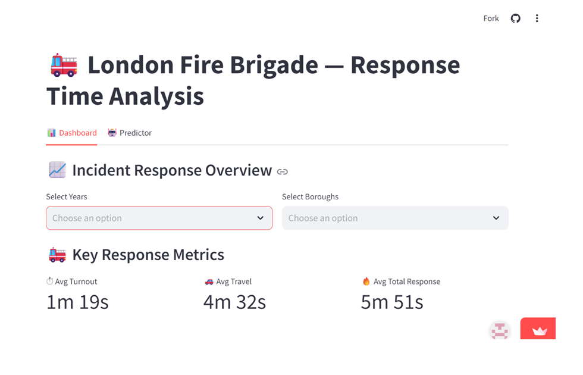
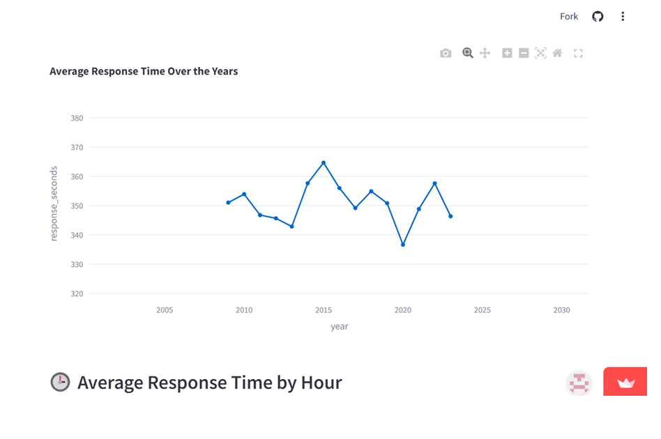
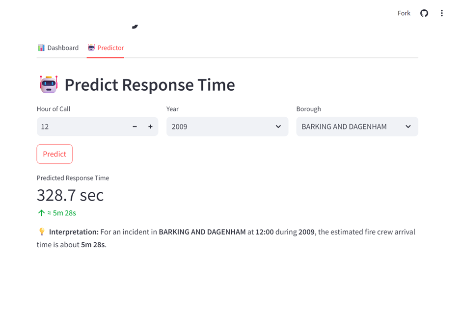

# 🚒 London Fire Brigade Response Time Analytics

An interactive **data science and machine learning project** for analysing and predicting **London Fire Brigade (LFB)** response times using **Python, Streamlit, Scikit-learn, Plotly, Docker and GitHub Actions**.

Originally developed as a **group project** during the **DataScientest Data Science programme**, this project was subsequently **extended and enhanced by Shabnam B. Mahammad** into a fully interactive Streamlit web application featuring machine learning prediction, exploratory analytics, Docker containerisation and continuous integration with GitHub Actions.

---



---

# 📑 Table of Contents

- [📸 Application Preview](#-application-preview)
- [📖 Project Overview](#-project-overview)
- [🎯 Project Objectives](#-project-objectives)
- [📂 Dataset](#-dataset)
- [✨ Features](#-features)
- [🛠 Technology Stack](#-technology-stack)
- [📊 Interactive Dashboard](#-interactive-dashboard)
- [🤖 Machine Learning Pipeline](#-machine-learning-pipeline)
- [📈 Model Performance](#-model-performance)
- [⚡ Performance Optimisations](#-performance-optimisations)
- [🐳 Deployment](#-deployment)
- [📁 Repository Structure](#-repository-structure)
- [🚀 Getting Started](#-getting-started)
- [🔮 Future Improvements](#-future-improvements)
- [👩‍💻 Author](#-author)

---

# 📸 Application Preview


## Analytics Dashboard



---

## Response Time Predictor



---

# 📖 Project Overview

Emergency response time is one of the most important operational performance indicators for fire and rescue services.

This project analyses historical **London Fire Brigade mobilisation and incident data** to explore emergency response performance across London boroughs between **2009 and 2023**.

The application enables users to:

- Explore historical response time trends.
- Compare borough-level performance.
- Analyse yearly and hourly response patterns.
- Predict expected response times using machine learning.
- Visualise historical and forecasted trends through an interactive Streamlit application.

Originally developed as part of the **DataScientest Data Science programme**, the project has since been extended into a deployable analytics application with interactive dashboards, containerisation and continuous integration.

---

# 🎯 Project Objectives

The project aims to:

- Analyse historical London Fire Brigade response performance.
- Identify patterns affecting emergency response times.
- Compare operational performance across boroughs.
- Develop a predictive machine learning model.
- Provide an intuitive web application for interactive exploration.
- Demonstrate an end-to-end data science workflow from raw data to deployment.

---

# 📂 Dataset

The project uses publicly available datasets released by the **London Fire Brigade**.

The analysis combines:

- Incident dataset
- Mobilisation dataset

The study focuses on incidents recorded between **2009 and 2023**.

To keep the repository lightweight, large datasets are compressed and distributed through **GitHub Releases**.

---

# ✨ Features

✅ Interactive Streamlit web application

✅ Borough-level response time analytics

✅ Yearly trend analysis

✅ Hourly response analysis

✅ Interactive data visualisation

✅ Machine learning prediction

✅ Forecast visualisation

✅ Docker containerisation

✅ GitHub Actions continuous integration

---

# 🛠 Technology Stack

| Category | Technologies |
|------------|-------------|
| Programming | Python |
| Data Analysis | Pandas, NumPy |
| Machine Learning | Scikit-learn |
| Visualisation | Plotly, Streamlit |
| Feature Engineering | Pandas |
| Model Pipeline | ColumnTransformer, Pipeline |
| Deployment | Streamlit Cloud |
| Containerisation | Docker |
| CI | GitHub Actions |

---

# 📊 Interactive Dashboard

Live Demo: **[Click Here to Open](https://sha-md-london-fire-brigade-response-analysis-app-ru7by8.streamlit.app/)**

The Streamlit application provides multiple interactive views for exploring response time data.

### Dashboard

- Key performance metrics
- Borough comparison
- Response time distribution

### Analytics

- Yearly response trends
- Hourly response trends
- Interactive visualisations

### Predictor

Users can estimate expected response time by selecting:

- Borough
- Hour of call
- Year

The application returns the predicted response time generated by the trained machine learning model.

---

# 🤖 Machine Learning Pipeline

The deployed prediction model is built using **Scikit-learn's Pipeline API**.

The workflow includes:

- Data preprocessing
- Feature engineering
- Categorical encoding
- Model training
- Prediction
- Forecast visualisation

Pipeline components include:

- ColumnTransformer
- OneHotEncoder
- RandomForestRegressor

This architecture keeps preprocessing and prediction within a single reusable pipeline.

---

# 📈 Model Performance

Multiple regression algorithms were evaluated during model development.

The deployed application uses a **Random Forest Regressor**, selected for its balance between predictive performance and inference speed within the Streamlit application.

| Metric | Value |
|---------|------:|
| Mean Absolute Error (MAE) | ~56 seconds |

---

# ⚡ Performance Optimisations

Several techniques improve application responsiveness.

- `st.cache_data()` for dataset caching.
- `st.cache_resource()` for model caching.
- Compressed `.csv.gz` datasets.
- Efficient preprocessing using Scikit-learn Pipelines.
- Random sampling for faster exploratory analysis.

These optimisations reduce loading times and improve the overall user experience.

---

# 🐳 Deployment

The application is fully containerised using Docker.

Continuous Integration is implemented using GitHub Actions, automatically building the Docker image whenever new changes are pushed to the repository.

Deployment components include:

- Docker
- GitHub Actions
- Streamlit

---

# 📁 Repository Structure

```text
London-Fire-Brigade-Response-Analysis
│
├── .github/
│   └── workflows/
│       └── ci.yml
│
├── assets/
│   └── screenshots/
│       ├── dashboard-overview.png
│       ├── analytics-dashboard.png
│       └── predictor.png
│
├── notebooks/
│
├── app.py
├── Dockerfile
├── requirements.txt
├── style.css
└── README.md
```

---

# 🚀 Getting Started

## Clone the repository

```bash
git clone https://github.com/sha-md/London-Fire-Brigade-Response-Analysis.git
```

## Navigate to the project

```bash
cd London-Fire-Brigade-Response-Analysis
```

## Install dependencies

```bash
pip install -r requirements.txt
```

## Run the Streamlit application

```bash
streamlit run app.py
```

---

## Using Docker

Build the Docker image.

```bash
docker build -t lfb-analysis .
```

Run the container.

```bash
docker run -p 8501:8501 lfb-analysis
```

---

# 🔮 Future Improvements

Potential future enhancements include:

- SHAP visualisations integrated into the dashboard.
- Hyperparameter optimisation.
- Geographic mapping of incidents.
- Enhanced forecasting models.
- Unit testing.
- Cloud deployment with automated monitoring.
- Modular project structure.

---

# 👩‍💻 Author

**Shabnam B. Mahammad**

**Shabnam Begam Mahammad**  
[LinkedIn](https://www.linkedin.com/in/shabnam-b-mahammad)
[Email](mailto:md.shabnam21@gmail.com) 

---


  


